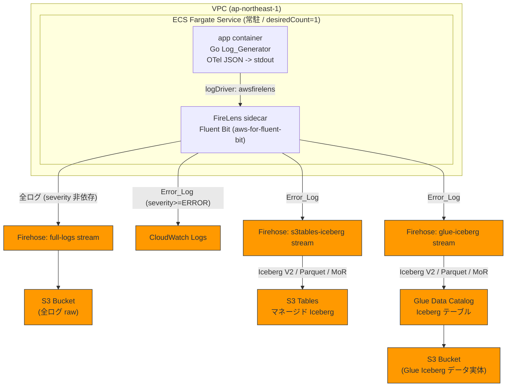

# 設計書

## Overview

本設計は、要件定義書 (`requirements.md`) で定義された「ECS Fargate 上で常駐稼働する Go 製ダミー OTel ログジェネレーター」と「FireLens (Fluent Bit) による severity ベースのログルーティング」「Amazon Data Firehose を介した S3 / CloudWatch Logs / Apache Iceberg への 2 段階配信」を実現するためのアーキテクチャ・コンポーネント・データモデル・テスト戦略を定める。

対象リージョンは **ap-northeast-1 (東京)**。すべてのインフラは **Terraform** で定義し、ステートは **ローカルバックエンド** で管理する (ロック機構なし。運用上の制約として明文化)。

パイプライン全体像は以下のとおり (要件 Requirement 1〜7 を網羅):

- **ステージ 1 (Requirement 1〜4)**: Go アプリが OTel Log Data Model 形式の JSON ログを stdout へ出力 → FireLens サイドカーが受信 → 全ログを Firehose 経由で S3 へ、ERROR/FATAL ログを CloudWatch Logs へ配信。
- **ステージ 2 (Requirement 5〜6)**: ERROR/FATAL ログを Firehose の Iceberg 配信機能で (a) S3 Tables マネージド Iceberg と (b) Glue Data Catalog 管理のセルフマネージド Iceberg の両方へ書き込む。
- **基盤 (Requirement 7)**: 上記すべてを Terraform で ap-northeast-1 にプロビジョニング。

### 設計上の主要判断と根拠

| 判断 | 根拠 / 関連要件 |
| --- | --- |
| ログジェネレーターを長期稼働プロセス + ECS service (desiredCount=1) として構成 | 常駐稼働と自己修復 (Req 2.1, 2.4) |
| FireLens の `awsfirelens` ログドライバ + Fluent Bit `rewrite_tag` による severity 分岐 | 1 入力ストリームから複数配信先へ severity ベースで振り分け (Req 3.3, 3.5) |
| 配信は Firehose に集約し、配信先別に複数ストリームを用意 | Firehose の Iceberg 配信機能と S3 バッファリングを活用 (Req 3.4, 4.2, 5.2, 6.3) |
| Iceberg は V2 / Parquet / Merge-on-Read 固定 | Firehose Iceberg 配信の前提制約 (Req 5.3, 6.4) |
| OTel のネスト構造を「主要フィールドのフラット化 + nested の JSON 文字列カラム化」でマッピング | Iceberg スキーマの単純化と S3 Tables の小文字カラム制約への適合 (Req 5.4, 5.5, 6.5) |

## Architecture



### レイヤ構成

1. **生成レイヤ (Go アプリ)**: OTel Log Data Model レコードを生成し JSON 1 行 (JSON Lines) として stdout へ出力 (Req 1)。
2. **ルーティングレイヤ (FireLens / Fluent Bit)**: stdout を受信し、OTel `severity` (または `severityNumber`) で配信先を分岐 (Req 3)。
3. **配信レイヤ (Amazon Data Firehose)**: 配信先別ストリームで S3 / Iceberg へ届ける。CloudWatch Logs へは Fluent Bit の `cloudwatch_logs` 出力で直接配信 (Req 4)。
4. **蓄積レイヤ (S3 / CloudWatch Logs / S3 Tables Iceberg / Glue Iceberg)** (Req 4〜6)。
5. **基盤レイヤ (Terraform)**: 全リソース定義・ローカルステート (Req 7)。

### ネットワーク構成 (Req 2.1, 3.4 のための egress 前提)

- **VPC**: パブリックサブネット (またはプライベートサブネット + NAT) を持つ VPC を 1 つ。
- **サブネット**: マルチ AZ (ap-northeast-1a / 1c) に最低 2 つ。Fargate タスクはこれらに配置。
- **セキュリティグループ**: インバウンドは不要 (常駐バッチ的なため公開ポートなし)。アウトバウンドは 443 (HTTPS) を許可し、Firehose / CloudWatch Logs / ECR エンドポイントへの到達を確保。
- **到達性**: パブリックサブネット + パブリック IP 割当、またはプライベートサブネット + NAT Gateway のいずれか。
- **VPC エンドポイント (任意)**: `com.amazonaws.ap-northeast-1.kinesis-firehose`、`...logs`、`...ecr.api/ecr.dkr`、`...s3` (Gateway) のインターフェース/ゲートウェイエンドポイントを作成すると NAT を介さず到達でき、コストとセキュリティ面で有利。本ハンズオンでは任意とする。

## Components and Interfaces

### 1. Log_Generator (Go アプリケーション) — Req 1, 2

責務: OTel Log Data Model 準拠のレコードを一定間隔で生成し stdout へ出力する。

主要モジュール (純粋ロジックと副作用を分離し、テスト容易性を確保):

```go
// otel パッケージ: OTel Log Data Model のレコード定義と生成 (純粋関数中心)
type SeverityNumber int // 1..24 (OTel 準拠)

const (
    SeverityTrace SeverityNumber = 1
    SeverityDebug SeverityNumber = 5
    SeverityInfo  SeverityNumber = 9
    SeverityWarn  SeverityNumber = 13
    SeverityError SeverityNumber = 17 // ERROR の下限
    SeverityFatal SeverityNumber = 21
)

type LogRecord struct {
    Timestamp      time.Time              `json:"timestamp"`      // ナノ秒精度 (RFC3339Nano)
    SeverityNumber SeverityNumber         `json:"severityNumber"`
    SeverityText   string                 `json:"severityText"`   // "ERROR", "FATAL" 等
    Body           string                 `json:"body"`
    Resource       map[string]any         `json:"resource"`       // ネスト属性
    Attributes     map[string]any         `json:"attributes"`     // ネスト属性
}

// IsError は severity が ERROR 以上 (>=17) か判定する (ルーティング判定の正典)
func (r LogRecord) IsError() bool { return r.SeverityNumber >= SeverityError }

// Generate は乱数源から 1 件の妥当な LogRecord を生成する (決定的にテスト可能)
func Generate(rng *rand.Rand, now time.Time) LogRecord

// scheduler パッケージ: 出力間隔の制御 (時計を注入し純粋にテスト可能)
type Scheduler struct {
    Interval time.Duration // 設定値 (外部から指定; Req 2.3)
}
func (s Scheduler) Next(prev time.Time) time.Time // prev + Interval

// config パッケージ
type Config struct {
    IntervalMillis int // 環境変数 LOG_INTERVAL_MS から読み込む (Req 2.3)
}
func LoadConfig(env map[string]string) (Config, error) // 無効値は error
```

インターフェース (I/O 境界):

- 入力: 環境変数 `LOG_INTERVAL_MS` (出力間隔ミリ秒)。
- 出力: `io.Writer` (本番は `os.Stdout`) へ JSON Lines を書き出す。テストでは `bytes.Buffer` を注入。
- 実行モデル: `for { rec := Generate(...); writeJSON(w, rec); sleep(until scheduler.Next) }` の無限ループ。プロセスが落ちても ECS service が再起動 (Req 2.4)。

### 2. ECS タスク定義 / サービス — Req 2, 3

```jsonc
// タスク定義 (要点)
{
  "requiresCompatibilities": ["FARGATE"],
  "networkMode": "awsvpc",
  "cpu": "256", "memory": "512",
  "taskRoleArn": "<ECS_TASK_ROLE>",
  "executionRoleArn": "<ECS_TASK_EXECUTION_ROLE>",
  "containerDefinitions": [
    {
      "name": "app",
      "image": "<ECR>/log-generator:latest",
      "essential": true,
      "environment": [{ "name": "LOG_INTERVAL_MS", "value": "1000" }],
      "logConfiguration": {
        "logDriver": "awsfirelens"            // Req 3.2: stdout を FireLens へ
      }
    },
    {
      "name": "log_router",
      "image": "<aws-for-fluent-bit イメージ>",
      "essential": true,
      "firelensConfiguration": {
        "type": "fluentbit",
        "options": { "config-file-type": "file", "config-file-value": "/fluent-bit/etc/custom.conf" }
      }
    }
  ]
}
```

- ECS Service: `desiredCount = 1`、`launchType = FARGATE`。タスク異常終了時はサービスが置換タスクを起動し常駐を維持 (Req 2.1, 2.4)。

### 3. FireLens_Router (Fluent Bit 設定) — Req 3, 4

severity に基づくルーティングは Fluent Bit の `rewrite_tag` フィルタでタグを派生させ、`Match` で OUTPUT を選別することで実現する。

設定アプローチ:

```ini
# [INPUT] は FireLens が forward で自動注入する (awsfirelens 経由のアプリ stdout)

# 1) severityNumber>=17 の Error_Log に error.* タグを付与 (元タグは保持)
[FILTER]
    Name          rewrite_tag
    Match         app-firelens*
    Rule          $severityNumber ^(1[7-9]|2[0-4])$  error.$TAG false
    Emitter_Name  re_emitted_errors

# 2) 全ログ -> Firehose (S3 full-logs)  ※severity 非依存 (Req 4.2, 4.3)
[OUTPUT]
    Name           kinesis_firehose
    Match          *
    region         ap-northeast-1
    delivery_stream ${FULL_LOGS_STREAM}

# 3) Error_Log -> CloudWatch Logs (Req 4.1)
[OUTPUT]
    Name              cloudwatch_logs
    Match             error.*
    region            ap-northeast-1
    log_group_name    ${ERROR_LOG_GROUP}
    log_stream_prefix ecs-
    auto_create_group true

# 4) Error_Log -> Firehose (S3 Tables Iceberg) (Req 5.2)
[OUTPUT]
    Name           kinesis_firehose
    Match          error.*
    region         ap-northeast-1
    delivery_stream ${S3TABLES_ICEBERG_STREAM}

# 5) Error_Log -> Firehose (Glue Iceberg) (Req 6.3)
[OUTPUT]
    Name           kinesis_firehose
    Match          error.*
    region         ap-northeast-1
    delivery_stream ${GLUE_ICEBERG_STREAM}
```

ルーティング規則 (severity → 配信先) の正典:

| severity | S3 (full) | CloudWatch | S3 Tables Iceberg | Glue Iceberg |
| --- | --- | --- | --- | --- |
| TRACE/DEBUG/INFO/WARN (<17) | ✅ | ❌ | ❌ | ❌ |
| ERROR/FATAL (>=17) | ✅ | ✅ | ✅ | ✅ |

> 補足: `$TAG` ベースの `rewrite_tag` により、元の `*` マッチ (全件 → S3) と派生 `error.*` マッチ (エラーのみ) が両立する。severity の判定は OTel レコードの `severityNumber` フィールド (>=17 が ERROR 以上) を用いる。`severityText` も補助的に利用可能。

### 4. Amazon Data Firehose 配信ストリーム — Req 4, 5, 6

3 本の配信ストリームを用意する:

| ストリーム | 配信先 | 内容 | 関連要件 |
| --- | --- | --- | --- |
| `full-logs` | S3 (raw) | 全 OTel ログ (JSON/GZIP) | Req 4.2, 4.3 |
| `s3tables-iceberg` | S3 Tables Iceberg | Error_Log のみ。Iceberg V2 / Parquet / MoR | Req 5.2, 5.3 |
| `glue-iceberg` | Glue Iceberg (S3 実体) | Error_Log のみ。Iceberg V2 / Parquet / MoR | Req 6.3, 6.4 |

Firehose Iceberg 配信の制約 (両 Iceberg ストリームに適用):

- テーブルフォーマット: **Apache Iceberg V2**。
- データファイル形式: **Parquet**。
- 行レベル操作: **Merge-on-Read (MoR)**。
- 宛先テーブルは Catalog (S3 Tables / Glue) に事前定義済みであること。
- **S3 Tables 宛では全カラム名を小文字** にする必要がある (Req 5.4)。Glue 側も整合のため小文字に統一。
- Firehose は受信レコードを宛先テーブルのスキーマにマッピングするため、レコード側のキー名 (小文字フラットフィールド) とテーブルカラム名を一致させる。

### 5. CloudWatch Logs — Req 4.1

- ロググループ (例: `/ecs/otel-pipeline/errors`) を Terraform で作成。
- Fluent Bit の `cloudwatch_logs` 出力で Error_Log のみを書き込む。

### 6. IAM ロール — Req 3, 4, 5, 6

| ロール | 用途 | 主な権限 |
| --- | --- | --- |
| **ECS Task Execution Role** | イメージ取得・ログ基盤 | `ecr:GetAuthorizationToken`, `ecr:BatchGetImage`, `logs:CreateLogStream/PutLogEvents` (起動時) |
| **ECS Task Role** (FireLens 実行時権限) | サイドカーからの配信 | `firehose:PutRecordBatch` (3 ストリーム), `logs:CreateLogGroup/CreateLogStream/PutLogEvents` (CloudWatch 出力) |
| **Firehose Delivery Role (full-logs)** | S3 書き込み | `s3:PutObject`, `s3:GetBucketLocation` (対象バケット) |
| **Firehose Delivery Role (s3tables-iceberg)** | S3 Tables Iceberg 書き込み | `s3tables:*` (テーブル/ネームスペース範囲), Glue Catalog 連携権限, 中間 S3 への `s3:PutObject` |
| **Firehose Delivery Role (glue-iceberg)** | Glue Iceberg 書き込み | `glue:GetTable/GetDatabase/UpdateTable`, データ実体バケットへの `s3:PutObject/GetObject/DeleteObject` |

最小権限の原則に従い、各ロールは必要なリソース ARN に限定する。

## Data Models

### OTel_Log_Record (生成・転送中の論理モデル) — Req 1.3

| フィールド | 型 | 説明 |
| --- | --- | --- |
| `timestamp` | string (RFC3339Nano) | イベント発生時刻 |
| `severityNumber` | int (1..24) | OTel 重大度数値。>=17 が ERROR 以上 |
| `severityText` | string | "TRACE".."FATAL" |
| `body` | string | ログ本文 |
| `resource` | object | リソース属性 (例: `service.name`, `host.name`) |
| `attributes` | object | 任意の属性 (例: `http.status_code`, `trace_id`) |

JSON Lines 例:

```json
{"timestamp":"2026-06-20T12:34:56.789012345Z","severityNumber":17,"severityText":"ERROR","body":"db connection failed","resource":{"service.name":"log-generator","host.name":"ip-10-0-1-23"},"attributes":{"error.type":"timeout","retry":3}}
```

### Iceberg_Schema_Mapping — Req 5.5, 6.5

マッピング方針: **主要フィールドをフラット化** (独立カラム) し、**ネスト構造 (`resource` / `attributes`) は JSON 文字列カラム** として保存する。これにより Iceberg のスキーマを単純な平坦テーブルに保ちつつ、ネスト情報を欠損なく保持できる。**全カラム名は小文字** とする (Req 5.4)。S3 Tables テーブルと Glue テーブルは同一論理スキーマを共有する (Req 6.5 の比較検証を容易にするため)。

#### Iceberg テーブルスキーマ (S3 Tables / Glue 共通)

| カラム名 (小文字) | Iceberg 型 | 由来する OTel フィールド | 変換 |
| --- | --- | --- | --- |
| `event_time` | `timestamp` | `timestamp` | RFC3339Nano → Iceberg timestamp |
| `severity_number` | `int` | `severityNumber` | そのまま |
| `severity_text` | `string` | `severityText` | そのまま (小文字カラム名へ格納) |
| `body` | `string` | `body` | そのまま |
| `resource_json` | `string` | `resource` | オブジェクトを JSON 文字列へシリアライズ |
| `attributes_json` | `string` | `attributes` | オブジェクトを JSON 文字列へシリアライズ |
| `ingest_date` | `string` (YYYY-MM-DD) | `timestamp` | パーティション列 (任意) |

Iceberg テーブルプロパティ (両ターゲット):

```
format-version = 2                 # Iceberg V2 (Req 5.3, 6.4)
write.format.default = parquet     # Parquet (Req 5.3, 6.4)
write.delete.mode = merge-on-read  # MoR
write.update.mode = merge-on-read
write.merge.mode  = merge-on-read
```

- **S3 Tables Iceberg** (`S3_Tables_Iceberg`): namespace + table を S3 Tables バケット内に作成。カラム名は上表の小文字を厳守 (Req 5.4)。
- **Glue Iceberg** (`Glue_Iceberg`): Glue database + table を作成し、`table_type=ICEBERG`、`location` は S3 実体バケットの prefix を指定 (Req 6.1, 6.2)。スキーマは上表と同一。

### S3 全ログ格納モデル — Req 4.2〜4.4

- バケット: `s3://<full-logs-bucket>/raw/`、`YYYY/MM/DD/HH` プレフィックス (Firehose の動的パーティショニング/時刻プレフィックス)。
- 形式: JSON Lines (任意で GZIP)。全 severity を無加工で格納 (絞り込みなし)。
- リージョン: ap-northeast-1 (Req 4.4)。

## Correctness Properties

*プロパティとは、システムのすべての正当な実行において成り立つべき特性や振る舞いであり、システムが何をすべきかについての形式的な言明である。プロパティは人間可読な仕様と機械検証可能な正当性保証との橋渡しとなる。*

本機能のうち、Go アプリのレコード生成ロジック、severity ベースのルーティング判定、Iceberg スキーママッピングは純粋関数として切り出せるため、プロパティベーステスト (PBT) が適用可能である。一方、Terraform リソース構成・ECS/Firehose/CloudWatch のマネージド挙動 (Prework で INTEGRATION/SMOKE と分類) は PBT 対象外とし、後述の Testing Strategy でスナップショット/統合/スモークテストとして扱う。

以下のプロパティは Prework 分析と Property Reflection に基づき、冗長性を排して導出した。

### Property 1: OTel レコードのスキーマ妥当性と JSON ラウンドトリップ

*任意の* 乱数源と時刻について、`Generate` が生成した `LogRecord` は OTel Log Data Model の必須フィールド (timestamp, severityNumber, severityText, body, resource, attributes) をすべて備え、`severityNumber` は 1..24 の範囲に収まり、JSON へシリアライズしてからデシリアライズすると元のレコードと等価になる。

**Validates: Requirements 1.2, 1.3**

### Property 2: 全ログの S3 ルーティング (severity 非依存)

*任意の* `LogRecord` の集合について、S3 (full-logs) 経路へ振り分けられるレコード集合は入力集合全体と一致する (severity による絞り込みが行われない)。

**Validates: Requirements 4.2, 4.3**

### Property 3: Error_Log のルーティング正当性

*任意の* `LogRecord` の集合について、CloudWatch Logs 経路・S3 Tables Iceberg 経路・Glue Iceberg 経路のそれぞれへ振り分けられるレコード集合は、`severityNumber >= 17` (ERROR 以上) を満たすレコードの集合と正確に一致する。すなわち非エラーログはこれら 3 経路に一切入らず、エラーログは必ず 3 経路すべてに入る。

**Validates: Requirements 3.3, 3.5, 4.1, 5.2, 6.3**

### Property 4: Iceberg スキーマの小文字カラム不変条件

*任意の* OTel フィールド名集合から `Iceberg_Schema_Mapping` が生成する Iceberg テーブルスキーマについて、生成された全カラム名は小文字である (各カラム名 `c` について `lower(c) == c`)。この不変条件は S3 Tables 用・Glue 用の両スキーマで成り立つ。

**Validates: Requirements 5.4**

### Property 5: スキーママッピングのネスト保持ラウンドトリップと両ターゲット等価性

*任意の* `LogRecord` について、`Iceberg_Schema_Mapping` を適用すると (a) timestamp / severity / body の主要フィールドがそれぞれ独立した平坦カラムへ格納され、(b) `resource` と `attributes` は JSON 文字列カラムへシリアライズされ、その JSON をパースすると元のネスト構造と等価に復元できる。さらに、同一レコードから生成した S3 Tables 用マッピング結果と Glue 用マッピング結果は論理的に等価 (同一カラム集合・同一型・同一小文字名・同一値) である。

**Validates: Requirements 5.5, 6.5**

### Property 6: 設定された出力間隔の適用

*任意の* 有効な間隔設定値について、`LoadConfig` が読み込んだ間隔が `Scheduler.Interval` に反映され、`Scheduler.Next(prev)` は常に `prev + Interval` を返す。無効な設定値 (負値・非数値・空) に対しては `LoadConfig` がエラーを返す。

**Validates: Requirements 2.2, 2.3**

## Error Handling

| 事象 | ハンドリング方針 | 関連要件 |
| --- | --- | --- |
| Go アプリのパニック/異常終了 | プロセス終了 → ECS サービスが置換タスクを起動し常駐継続 | Req 2.4 |
| 無効な間隔設定 (`LOG_INTERVAL_MS`) | `LoadConfig` がエラーを返し、起動時にフェイルファスト (明確なログを出して終了)。ECS が再起動を試みるため、誤設定は早期に検知される | Req 2.3 |
| Firehose への一時的な配信失敗 | Fluent Bit のリトライ (`Retry_Limit`) と Firehose 内部リトライ。Firehose のエラーレコードは S3 のエラープレフィックス (`errors/`) へ退避 | Req 3.4, 4.2 |
| Iceberg 配信失敗 (スキーマ不一致等) | Firehose の Iceberg 配信エラーは S3 バックアップ (error output) へ退避し、原データを失わない。スキーマ不一致を避けるため Property 4/5 でマッピングを保証 | Req 5.2, 6.3 |
| CloudWatch 配信失敗 | `cloudwatch_logs` 出力のリトライ。全ログは S3 経路で別途保全されるため最終的な記録は失われない | Req 4.1, 4.2 |
| JSON パース不能なレコード | Fluent Bit のパーサで非構造化として扱い、`severityNumber` 欠如時は非エラー扱い (S3 のみへ)。生成側は Property 1 で妥当な JSON を保証 | Req 1.2 |
| Terraform ローカルステートの同時アクセス | ロック機構を提供しない。運用制約として README/設計に明文化し、利用者が同時実行を避ける | Req 7.4 |

## Testing Strategy

ユニットテスト (具体例・エッジケース・エラー条件) とプロパティテスト (全入力に対する普遍的性質) を併用する。さらに、PBT 非適用の構成・マネージド挙動はスナップショット/統合/スモークテストで補完する。

### プロパティベーステスト (PBT)

- **対象**: Go アプリの純粋ロジック (レコード生成、ルーティング判定 `IsError` と経路判定関数、スキーママッピング、間隔設定)。
- **ライブラリ**: Go では `testing/quick` または `pgregory.net/rapid` などの確立されたプロパティテストライブラリを採用し、自前実装はしない。
- **反復回数**: 各プロパティテストは最低 **100 回** の反復を実行する。
- **タグ**: 各テストに設計プロパティへの参照コメントを付す。形式: `Feature: ecs-otel-log-pipeline, Property {番号}: {プロパティ本文}`。
- **マッピング**: 各 Correctness Property を **1 つの** プロパティテストで実装する。
  - Property 1 → レコード生成スキーマ妥当性 + JSON ラウンドトリップテスト。
  - Property 2 → 全件 S3 ルーティングテスト (ルーティング判定関数を対象)。
  - Property 3 → error ログのみが CloudWatch/Iceberg 経路へ入るルーティングテスト。
  - Property 4 → 生成スキーマの全カラム小文字検証テスト。
  - Property 5 → ネスト JSON ラウンドトリップ + 両ターゲットスキーマ等価性テスト。
  - Property 6 → 間隔設定の適用とスケジューラ計算テスト (時計注入)。

> 設計上、ルーティングロジックは Fluent Bit 設定で表現されるが、PBT では「OTel `severityNumber` を入力とし配信先集合を返す純粋関数 (Fluent Bit ルールと同等のリファレンス実装)」を Go (またはテスト言語) 側に用意して検証する。これにより Fluent Bit 設定の severity 閾値ロジックが要件どおりであることを担保する。

### ユニットテスト (例示・エッジケース)

- `LoadConfig`: 有効値/無効値 (空、`0`、負値、非数値) の境界。
- `Generate`: 出力が JSON Lines として 1 行で書けること、stdout ライター注入による書き込み確認 (Req 1.4)。
- severity 境界: `severityNumber=16` (WARN 上限近傍) と `17` (ERROR 下限) の分岐確認。

### スナップショット / 統合テスト (Terraform・マネージド挙動; PBT 非適用)

PBT が不適切な IaC・外部サービス構成は以下で検証する (Prework の INTEGRATION/SMOKE 分類に対応):

- **Terraform plan/validate スナップショット**: 必要リソース (VPC/サブネット/SG、ECS サービス・タスク定義、Firehose 3 ストリーム、S3 バケット 2 種、CloudWatch ロググループ、S3 Tables テーブル、Glue database/table、IAM ロール群) が含まれること (Req 7.1)。
- **リージョン確認**: provider region が `ap-northeast-1` (Req 4.4, 7.2)。
- **ECS 常駐構成**: service `launchType=FARGATE`、`desiredCount>=1` (Req 2.1, 2.4)。
- **FireLens 構成**: タスク定義に `firelensConfiguration` サイドカーが存在し、app コンテナの `logDriver=awsfirelens` (Req 3.1, 3.2)、Fluent Bit 設定に `kinesis_firehose` OUTPUT が存在 (Req 3.4)。
- **Iceberg テーブルプロパティ**: 両 Iceberg テーブルの `format-version=2` / `write.format.default=parquet` / MoR 設定 (Req 5.3, 6.4)。
- **Glue Iceberg ロケーション**: Glue テーブルの `location` が S3 パスであること (Req 6.2)。
- **バックエンド (スモーク)**: Terraform backend が `local` でありロック機構を持たないこと、運用制約がドキュメント化されていること (Req 7.3, 7.4)。
- **言語 (スモーク)**: Go アプリがビルド・コンパイルできること (Req 1.1)。

### エンドツーエンド検証 (手動 / 任意)

デプロイ後、アプリを一定時間稼働させ、(1) S3 に全 severity のログが蓄積されること、(2) CloudWatch に ERROR/FATAL のみが現れること、(3) S3 Tables / Glue の Iceberg テーブルを Athena でクエリしエラーログのみが行として存在すること、を 1〜2 例で確認する。
