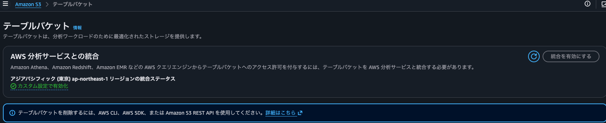
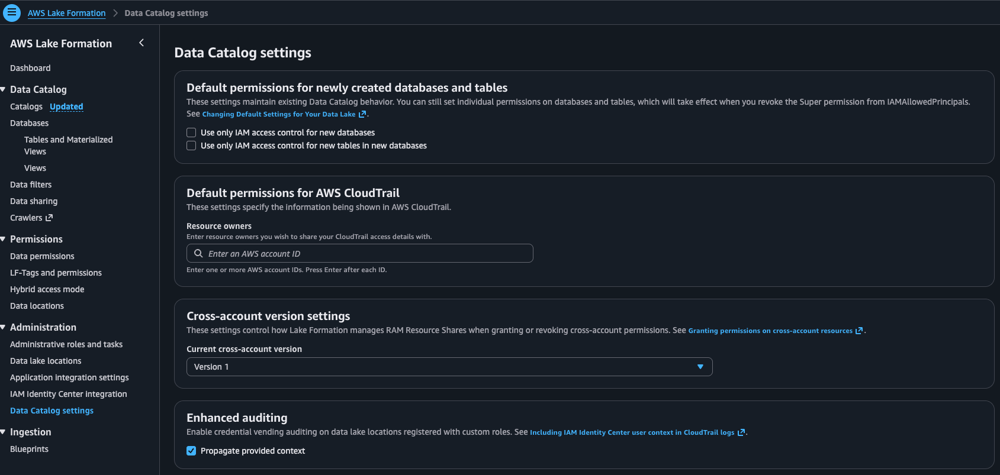

# handson-log-to-iceberg

Amazon Elastic Container Service (Amazon ECS) Fargate 上の Go 製ダミー OTel ログジェネレーターが出力するログを、FireLens (Fluent Bit) で severity ごとに振り分け、Amazon Data Firehose 経由で Amazon Simple Storage Service (Amazon S3) / Amazon CloudWatch Logs / Apache Iceberg (Amazon S3 Tables・AWS Glue) へ配信・蓄積するハンズオンです。

インフラはすべて Terraform (`infra/`) で構築します、リージョンは **ap-northeast-1 (東京)** を対象とします。


## リポジトリ構成

| パス          | 内容                                                                                                                                                                                                                                      |
| ------------- | ----------------------------------------------------------------------------------------------------------------------------------------------------------------------------------------------------------------------------------------- |
| `app/`        | Go 製ダミー OTel ログジェネレーター + マルチステージ `Dockerfile`                                                                                                                                                                         |
| `fluent-bit/` | FireLens (Fluent Bit) 設定。`custom.conf` (severity ベースルーティング)、`parsers.conf` (アプリ JSON を `log` から展開する parser)、`iceberg_transform.lua` (Iceberg 向けスキーマ整形)、`Dockerfile` (これらをベイクするカスタムイメージ) |
| `infra/`      | Terraform 構成一式 (Amazon VPC / Amazon ECS / Amazon Data Firehose / Amazon S3 / Amazon S3 Tables / AWS Glue / AWS IAM など)                                                                                                              |

## Infrastructure (Terraform)

Terraform 構成は `infra/` ディレクトリに配置されています。

> **必要バージョン**
> Terraform `>= 1.5`、AWS provider `~> 6.4` (`hashicorp/aws`)。Amazon S3 Tables テーブルのスキーマ

---

# 前提

この手順では以下機能を有効化します。

- `AWS 分析サービスとの統合`
  - Amazon Athena、Amazon Redshift、Amazon EMR などの AWS クエリエンジンからテーブルバケットへのアクセスを許可する機能
- `Lakeformationの有効化`
  - アクセス制御の権威が IAM だけでなく Lake Formation の Grant にも及ぶようになり、より細かい粒度(列/行レベル)でデータガバナンスを一元管理できるようになる機能

`AWS 分析サービスとの統合`を有効化した後の解除方法が、調べきれなかったので、戻し作業は対象外です。
**統合を避けたい場合には以降の作業を避けてください。**

# AWS 分析サービスとの統合

Amazon S3 > テーブルバケット > `統合を有効にする`


# Lakeformationの有効化

AWS Lake Formation > Data Catalog settings > Default permissions for newly created databases and tables > チェックボックスを2つ外す

- `Use only IAM access control for new databases`
- `Use only IAM access control for new tables in new databases`



# 作業用 Amazon EC2 インスタンス上でハンズオンを実行する

ローカル環境に Terraform / Go / Docker を導入せず、AWS 内に作成した **作業用 Amazon Elastic Compute Cloud (Amazon EC2) インスタンス** の中でハンズオン (イメージのビルド & プッシュ、`terraform apply`、検証) を完結させる手順です。

> **なぜ Amazon EC2 を使うのか**
>
> - コンテナのビルド対象は `linux/amd64` です。**x86_64 の Amazon EC2** 上で実行すればエミュレーションなしでネイティブにビルドできます。
> - 必要なツール (Go / Docker / Terraform / AWS Command Line Interface (AWS CLI)) を 1 台に閉じ込められ、後片付けが容易です。
> - 接続は **AWS Systems Manager (SSM) Session Manager** を使うため、SSH キーや受信ポート (22番) の開放が不要です。

## 全体の流れ

1. Amazon EC2 用の AWS Identity and Access Management (IAM) ロール (インスタンスプロファイル) を作成する (マネジメントコンソール)
2. 作業用 Amazon EC2 を作成する (マネジメントコンソール)
3. SSM Session Manager で Amazon EC2 に接続する
4. Amazon EC2 内に必要ツールをインストールする
5. リポジトリを取得し、ハンズオンを実行する
6. 検証 (E2E)
7. 後片付け (Amazon EC2・IAM・AWS リソースの削除)

## 前提

- AWS アカウントを保有し、対象リージョンは **ap-northeast-1**。
- AWS マネジメントコンソールにログインできること。
- Amazon EC2 / IAM を作成できる権限を持つこと。

## ステップ 0: Amazon EC2 用 IAM ロール (インスタンスプロファイル) の作成

作業用 Amazon EC2 はハンズオンの全 AWS リソース (Amazon VPC・Amazon ECS・Amazon Data Firehose・Amazon S3・Amazon S3 Tables・AWS Glue・IAM ロール など) を Terraform で作成します。そのため Amazon EC2 には十分な権限が必要です。

### IAM 準備 (マネジメントコンソール)

1. AWS マネジメントコンソールで リージョンを「アジアパシフィック (東京) ap-northeast-1」に切り替える。
2. **IAM** サービスを開き、左メニューから「ロール」を選択し、「ロールを作成」をクリック。
3. 信頼されたエンティティタイプ: 「AWS のサービス」を選択。ユースケース: 「EC2」を選択し、「次へ」をクリック。
4. 許可ポリシーの追加:
   - 検索欄で `AdministratorAccess` を検索し、チェックを入れる。
   - 続けて `AmazonSSMManagedInstanceCore` を検索し、チェックを入れる。
   - 「次へ」をクリック。
5. ロール名: `handson-iceberg-ec2-role` を入力。
6. 「ロールを作成」をクリック。

## ステップ 1: 作業用 Amazon EC2 の作成

推奨スペック: **Amazon Linux 2023 / x86_64 / t3.large (2 vCPU・8 GB) / gp3 30 GB**。Docker ビルドと Terraform を快適に動かすため t3.large 程度を推奨します。

ステップ 0 でロール (インスタンスプロファイル) を作成済みであることが前提です。

### マネジメントコンソールで Amazon EC2 を起動

1. AWS マネジメントコンソールで リージョンを「アジアパシフィック (東京) ap-northeast-1」に切り替える。
2. **Amazon EC2** サービスを開き、左メニューから「インスタンス」を選択し、「インスタンスを起動」をクリック。
3. **名前とタグ**: 名前に `handson-iceberg-builder` を入力。
4. **アプリケーションおよび OS イメージ (AMI)**: Amazon Linux → **Amazon Linux 2023 (64 ビット x86)** を選択。
5. **インスタンスタイプ**: `t3.large` を選択。
6. **キーペア (ログイン)**: SSM で接続するため「**キーペアなしで続行**」を選択 (SSH は使いません)。
7. **ネットワーク設定**: 既定の Amazon VPC / サブネット。「**パブリック IP の自動割り当て**」を **有効** にする。セキュリティグループは`default`。
8. **ストレージを設定**: ルートボリュームを **30 GiB / gp3** に変更。
9. **高度な詳細** を展開:
   - **IAM インスタンスプロファイル**: `handson-iceberg-ec2-role` を選択。
10. 右側の概要を確認し「**インスタンスを起動**」をクリック。
11. インスタンス一覧画面で、ステータスチェックが **2/2** になるまで待つ。

## ステップ 2: Amazon EC2 へ接続する (SSM Session Manager)

マネジメントコンソールから直接接続できます。

1. **Amazon EC2** サービス → 左メニュー「インスタンス」で `handson-iceberg-builder` を選択。
2. 画面上部の「接続」ボタンをクリック。
3. 「Session Manager」タブを選択し、「接続」をクリック。

ブラウザ内にターミナルが開きます。以降のコマンドは Amazon EC2 内で実行します (必要に応じて `sudo` を使用)。

> **AWS CLI から接続する場合 (任意)**
> 手元の端末に Session Manager プラグインが導入済みであれば、インスタンス一覧画面で確認できるインスタンス ID を使って以下でも接続できます。
>
> ```bash
> aws ssm start-session --region ap-northeast-1 --target <インスタンスID>
> ```

## ステップ 3: Amazon EC2 内に必要ツールをインストールする

Amazon Linux 2023 には AWS CLI v2 と SSM Agent が同梱されています。Git / Docker / Go / Terraform を導入します。

```bash
# Git と Docker、jq (Lake Formation 設定の JSON 編集に使用)
sudo dnf install -y git docker jq

# Docker を起動 (以降の docker コマンドはすべて sudo を付けて実行する)
sudo systemctl enable --now docker

# Go (公式 tarball / バージョンは go.mod の go 1.25 系に合わせる)
GO_VERSION=1.25.5
curl -fsSL "https://go.dev/dl/go${GO_VERSION}.linux-amd64.tar.gz" -o /tmp/go.tgz
sudo rm -rf /usr/local/go && sudo tar -C /usr/local -xzf /tmp/go.tgz
echo 'export PATH=$PATH:/usr/local/go/bin' | sudo tee /etc/profile.d/go.sh
export PATH=$PATH:/usr/local/go/bin

# Terraform (HashiCorp 公式 dnf リポジトリ)
sudo dnf install -y dnf-plugins-core
sudo dnf config-manager --add-repo https://rpm.releases.hashicorp.com/AmazonLinux/hashicorp.repo
sudo dnf install -y terraform

# バージョン確認
aws --version
git --version
sudo docker --version
go version
terraform version
```

## ステップ 4: リポジトリを取得してハンズオンを実行する

```bash
# 作業ディレクトリへ
cd ~

# リポジトリを取得 (このリポジトリの URL を指定)
git clone https://github.com/shigeru-oda/handson-log-to-iceberg-20260620.git handson-log-to-iceberg
cd handson-log-to-iceberg

# アカウント ID / レジストリを変数化
export AWS_REGION=ap-northeast-1
export ACCOUNT_ID=$(aws sts get-caller-identity --query Account --output text)
export ECR_REGISTRY="${ACCOUNT_ID}.dkr.ecr.${AWS_REGION}.amazonaws.com"

# --- 1) Amazon Elastic Container Registry (Amazon ECR) リポジトリ作成 & ログイン ---
aws ecr describe-repositories --repository-names log-generator --region "$AWS_REGION" \
  || aws ecr create-repository --repository-name log-generator --region "$AWS_REGION"
aws ecr describe-repositories --repository-names custom-fluent-bit --region "$AWS_REGION" \
  || aws ecr create-repository --repository-name custom-fluent-bit --region "$AWS_REGION"

aws ecr get-login-password --region "$AWS_REGION" \
  | sudo docker login --username AWS --password-stdin "$ECR_REGISTRY"

# --- 2) アプリイメージのビルド & プッシュ (linux/amd64) ---
sudo docker build --platform linux/amd64 -t "${ECR_REGISTRY}/log-generator:latest" ./app
sudo docker push "${ECR_REGISTRY}/log-generator:latest"

# --- 3) カスタム Fluent Bit イメージ (custom.conf 等をベイク) のビルド & プッシュ ---
# fluent-bit/Dockerfile はリポジトリに含まれており、custom.conf に加えて
# "log" 文字列の JSON 展開用 parser (parsers.conf) と、Iceberg スキーマ整形用の
# Lua スクリプト (iceberg_transform.lua) を /fluent-bit/etc/ へ COPY する。
sudo docker build --platform linux/amd64 -t "${ECR_REGISTRY}/custom-fluent-bit:latest" ./fluent-bit
sudo docker push "${ECR_REGISTRY}/custom-fluent-bit:latest"

# --- 4) Terraform でインフラをデプロイ ---
cd infra
terraform init
terraform validate
terraform apply # 権限不足で落ちる
```

### Lake Formation 権限付与

#### 共通変数

```bash
export AWS_REGION=ap-northeast-1
export ACCOUNT_ID=$(aws sts get-caller-identity --query Account --output text)

# 命名はデフォルト (project=otel-log-pipeline / environment=dev) に基づく
S3TABLES_BUCKET=otel-log-pipeline-dev-s3tables
NAMESPACE=otel_log_pipeline_dev
S3TABLES_TABLE=error_logs
FIREHOSE_S3TABLES_ROLE=arn:aws:iam::${ACCOUNT_ID}:role/otel-log-pipeline-dev-firehose-s3tables-iceberg
S3TABLES_CATALOG=${ACCOUNT_ID}:s3tablescatalog/${S3TABLES_BUCKET}
```

#### 1) 実行ロールを Lake Formation 管理者に追加 (既存管理者は保持)

`put-data-lake-settings` は管理者一覧を全置換するため、既存の管理者を残したまま自分を追記します。

```bash
# 現在の管理者を確認
aws lakeformation get-data-lake-settings --region "$AWS_REGION" \
  --query 'DataLakeSettings.DataLakeAdmins'

# 実行中のロール (作業用 Amazon EC2 のインスタンスプロファイルロール) の ARN
MYROLE=arn:aws:iam::${ACCOUNT_ID}:role/handson-iceberg-ec2-role
echo "$MYROLE"

# 既存設定を保持しつつ DataLakeAdmins に自分を追記して反映
aws lakeformation get-data-lake-settings --region "$AWS_REGION" \
  | jq --arg r "$MYROLE" '.DataLakeSettings | .DataLakeAdmins += [{"DataLakePrincipalIdentifier":$r}]' \
  > /tmp/lf-settings.json
aws lakeformation put-data-lake-settings --region "$AWS_REGION" \
  --data-lake-settings file:///tmp/lf-settings.json

# 反映確認 (既存 + handson-iceberg-ec2-roleになる)
aws lakeformation get-data-lake-settings --region "$AWS_REGION" \
  --query 'DataLakeSettings.DataLakeAdmins'
```

#### 2) Amazon S3 Tables の namespace / table を先に作成

Amazon S3 Tables への grant は対象テーブルが存在している必要があるため、該当リソースだけ先に作成します。

```bash
cd infra
terraform init
terraform apply \
  -target=aws_s3tables_table_bucket.iceberg \
  -target=aws_s3tables_namespace.iceberg \
  -target=aws_s3tables_table.error_logs
```

#### 3) Amazon Data Firehose ロールへ Amazon S3 Tables (federated カタログ) の権限を付与

```bash
# database (= namespace) に DESCRIBE
aws lakeformation grant-permissions --region "$AWS_REGION" \
  --principal DataLakePrincipalIdentifier="$FIREHOSE_S3TABLES_ROLE" \
  --permissions DESCRIBE \
  --resource "{\"Database\":{\"CatalogId\":\"$S3TABLES_CATALOG\",\"Name\":\"$NAMESPACE\"}}"

# table に ALL (最小化する場合は DESCRIBE SELECT INSERT ALTER)
aws lakeformation grant-permissions --region "$AWS_REGION" \
  --principal DataLakePrincipalIdentifier="$FIREHOSE_S3TABLES_ROLE" \
  --permissions ALL \
  --resource "{\"Table\":{\"CatalogId\":\"$S3TABLES_CATALOG\",\"DatabaseName\":\"$NAMESPACE\",\"Name\":\"$S3TABLES_TABLE\"}}"
```

付与確認 (Principal 指定時は Resource も必須):

```bash
aws lakeformation list-permissions --region "$AWS_REGION" \
  --principal DataLakePrincipalIdentifier="$FIREHOSE_S3TABLES_ROLE" \
  --resource "{\"Database\":{\"CatalogId\":\"$S3TABLES_CATALOG\",\"Name\":\"$NAMESPACE\"}}" \
  --query 'PrincipalResourcePermissions[].Permissions'   # => [["DESCRIBE"]]

aws lakeformation list-permissions --region "$AWS_REGION" \
  --principal DataLakePrincipalIdentifier="$FIREHOSE_S3TABLES_ROLE" \
  --resource "{\"Table\":{\"CatalogId\":\"$S3TABLES_CATALOG\",\"DatabaseName\":\"$NAMESPACE\",\"Name\":\"$S3TABLES_TABLE\"}}" \
  --query 'PrincipalResourcePermissions[].Permissions'   # => [["ALL"]]
```

#### 4) 検証 (Amazon Athena) と後片付け (`terraform destroy`) で使うロールへ権限を付与

手順1で Data Lake 管理者に追加したロールであっても、**テーブルデータへの実効権限は別途付与が必要**です (管理者・grant option はあっても実効権限がないと、Amazon Athena は `COLUMN_NOT_FOUND` で、`terraform destroy` は `Insufficient Lake Formation permission(s): Required Drop on errors` で失敗します)。

検証 (`SELECT`/`DESCRIBE`) と destroy (`DROP`/`ALTER`/`DELETE` 等) の両方で使うロールへ、まとめて付与しておきます。作業用 Amazon EC2 上で検証・デプロイ・後片付けを行うため、`handson-iceberg-ec2-role` (ステップ 0 で作成したインスタンスプロファイルのロール) に付与します。

```bash
QUERY_ROLE=arn:aws:iam::${ACCOUNT_ID}:role/handson-iceberg-ec2-role

# AWS Glue セルフマネージド側: table へ検証+destroy で必要な実効権限を付与
aws lakeformation grant-permissions --region "$AWS_REGION" \
  --principal DataLakePrincipalIdentifier="$QUERY_ROLE" \
  --permissions SELECT DESCRIBE DROP ALTER DELETE \
  --resource '{"Table":{"DatabaseName":"otel_log_pipeline_dev_logs","Name":"errors"}}'

# AWS Glue セルフマネージド側: database へ destroy で必要な実効権限を付与
aws lakeformation grant-permissions --region "$AWS_REGION" \
  --principal DataLakePrincipalIdentifier="$QUERY_ROLE" \
  --permissions DESCRIBE DROP CREATE_TABLE \
  --resource '{"Database":{"Name":"otel_log_pipeline_dev_logs"}}'

# Amazon S3 Tables 側 (federated カタログ): namespace (database) に DESCRIBE
aws lakeformation grant-permissions --region "$AWS_REGION" \
  --principal DataLakePrincipalIdentifier="$QUERY_ROLE" \
  --permissions DESCRIBE \
  --resource "{\"Database\":{\"CatalogId\":\"$S3TABLES_CATALOG\",\"Name\":\"$NAMESPACE\"}}"

# Amazon S3 Tables 側 (federated カタログ): table へ検証+destroy で必要な実効権限を付与
aws lakeformation grant-permissions --region "$AWS_REGION" \
  --principal DataLakePrincipalIdentifier="$QUERY_ROLE" \
  --permissions SELECT DESCRIBE DROP ALTER DELETE \
  --resource "{\"Table\":{\"CatalogId\":\"$S3TABLES_CATALOG\",\"DatabaseName\":\"$NAMESPACE\",\"Name\":\"$S3TABLES_TABLE\"}}"
```

付与確認 (`Permissions` に実効権限が入っていることを確認する。):

```bash
aws lakeformation list-permissions --region "$AWS_REGION" \
  --principal DataLakePrincipalIdentifier="$QUERY_ROLE" \
  --resource '{"Table":{"DatabaseName":"otel_log_pipeline_dev_logs","Name":"errors"}}' \
  --query 'PrincipalResourcePermissions[].Permissions'

aws lakeformation list-permissions --region "$AWS_REGION" \
  --principal DataLakePrincipalIdentifier="$QUERY_ROLE" \
  --resource "{\"Table\":{\"CatalogId\":\"$S3TABLES_CATALOG\",\"DatabaseName\":\"$NAMESPACE\",\"Name\":\"$S3TABLES_TABLE\"}}" \
  --query 'PrincipalResourcePermissions[].Permissions'
```

#### 5) 残りをデプロイ

```bash
# イメージは既定で実行アカウント/リージョンの Amazon ECR から自動解決されるため -var は不要。
terraform apply
```

デプロイ後の動作確認は次の「ステップ 5: 検証 (E2E)」に沿って実施してください。

## ステップ 5: 検証 (E2E)

デプロイした Amazon ECS タスクが実際に稼働し、severity ごとに正しく振り分けられて各配信先に蓄積されていることを確認します。
配信されるまでは5分程度要しますので、データが空の場合には時間をおいてリトライしてください。

### 前提: 環境変数の設定

```bash
export AWS_REGION=ap-northeast-1
export FULL_LOGS_BUCKET=$(terraform output -raw full_logs_bucket_name)
export ERROR_LOG_GROUP=$(terraform output -raw cloudwatch_logs_group_name)
export GLUE_DATABASE=$(terraform output -raw glue_database_name)
export GLUE_TABLE=$(terraform output -raw glue_iceberg_table_name)
export S3TABLES_BUCKET=$(terraform output -raw s3tables_bucket_arn | cut -d/ -f2)
export S3TABLES_NAMESPACE=$(terraform output -raw s3tables_namespace)
export S3TABLES_TABLE=$(terraform output -raw s3tables_table_name)
export ECS_CLUSTER=$(terraform output -raw ecs_cluster_name)
export ECS_SERVICE=$(terraform output -raw ecs_service_name)
```

### 検証 1: Amazon S3 (full-logs) に全 severity が無加工で蓄積される

```bash
aws s3api list-objects-v2 --bucket "$FULL_LOGS_BUCKET" --prefix "raw/" \
  --region ap-northeast-1 --max-items 50 \
  --query 'Contents[].Key' --output table
```

期待結果: `raw/YYYY/MM/DD/HH/` 配下にオブジェクトが存在する。

続いて、最新オブジェクトをダウンロードして severity の種類を確認します。

```bash
# 最新オブジェクトのキーを取得してダウンロード
KEY=$(aws s3api list-objects-v2 --bucket "$FULL_LOGS_BUCKET" --prefix "raw/" \
      --region ap-northeast-1 --query 'sort_by(Contents,&LastModified)[-1].Key' --output text)
aws s3 cp "s3://${FULL_LOGS_BUCKET}/${KEY}" /tmp/full-logs-sample.gz --region ap-northeast-1

# severityText の出現種類を集計
gunzip -c /tmp/full-logs-sample.gz \
  | python3 -c "import sys,json,collections; c=collections.Counter(json.loads(l)['severityText'] for l in sys.stdin if l.strip()); print(dict(c))"
```

期待結果: `TRACE`/`DEBUG`/`INFO`/`WARN`/`ERROR`/`FATAL` のうち複数 (理想的には全て) の severity が出現し、**ERROR/FATAL 以外の非エラーログも必ず含まれている** こと (= severity で絞り込まれていない)。1オブジェクトで一部 severity が出ない場合は、複数オブジェクトを取得するか稼働時間を延ばして再確認する。

### 検証 2: Amazon CloudWatch Logs (errors) に ERROR/FATAL のみが現れる

```bash
aws logs filter-log-events \
  --log-group-name "$ERROR_LOG_GROUP" --region ap-northeast-1 \
  --log-stream-name-prefix "ecs-" \
  --start-time "$(( ( $(date +%s) - 3600 ) * 1000 ))" \
  --max-items 30 \
  --query 'events[].message' --output json \
  | python3 -c "import sys,json; [print(json.loads(m)['severityText']) for m in json.load(sys.stdin)]"
```

期待結果: 出力される全レコードが `ERROR` または `FATAL` のみ (`INFO`/`WARN`/`DEBUG`/`TRACE` は 0 件)。

### 検証 3: Iceberg テーブル (Amazon S3 Tables / AWS Glue) にエラーログのみが存在する

Amazon Athena (エンジン v3) に AWS CLI でクエリを投げます。

```bash
export ATHENA_OUTPUT="s3://${FULL_LOGS_BUCKET}/athena-results/"

# クエリを実行し、完了を待って結果を表示する簡易ヘルパー
run_athena() {
  local sql="$1"
  local qid
  qid=$(aws athena start-query-execution \
        --region ap-northeast-1 \
        --query-string "$sql" \
        --result-configuration "OutputLocation=${ATHENA_OUTPUT}" \
        --query QueryExecutionId --output text)

  while :; do
    state=$(aws athena get-query-execution --region ap-northeast-1 \
             --query-execution-id "$qid" \
             --query 'QueryExecution.Status.State' --output text)
    case "$state" in
      SUCCEEDED|FAILED|CANCELLED) break ;;
    esac
    sleep 2
  done

  if [ "$state" != "SUCCEEDED" ]; then
    echo "Query $state" >&2
    aws athena get-query-execution --region ap-northeast-1 --query-execution-id "$qid" \
      --query 'QueryExecution.Status.StateChangeReason' --output text >&2
    return 1
  fi

  aws athena get-query-results --region ap-northeast-1 --query-execution-id "$qid" \
    --query 'ResultSet.Rows[].Data[].VarCharValue' --output table
}

# AWS Glue セルフマネージド側
run_athena "SELECT count(*) AS total,
                   count_if(severity_text IN ('ERROR','FATAL')) AS error_rows,
                   count_if(severity_text NOT IN ('ERROR','FATAL')) AS non_error_rows
            FROM \"otel_log_pipeline_dev_logs\".\"errors\";"

# Amazon S3 Tables 側 (federated カタログのため 3 階層パスで参照)
run_athena "SELECT count(*) AS total,
                   count_if(severity_text IN ('ERROR','FATAL')) AS error_rows,
                   count_if(severity_text NOT IN ('ERROR','FATAL')) AS non_error_rows
            FROM \"s3tablescatalog/otel-log-pipeline-dev-s3tables\".\"otel_log_pipeline_dev\".\"error_logs\";"
```

期待結果: 両テーブルとも `total > 0` かつ `error_rows = total` かつ `non_error_rows = 0` (= `severity_text` が `ERROR`/`FATAL` の行のみが存在)。

続いて、`severity_text` の分布を確認します。

```bash
# AWS Glue セルフマネージド側
run_athena "SELECT severity_text, count(*) AS cnt
            FROM \"otel_log_pipeline_dev_logs\".\"errors\"
            GROUP BY severity_text;"

# Amazon S3 Tables 側 (federated カタログのため 3 階層パスで参照)
run_athena "SELECT severity_text, count(*) AS cnt
            FROM \"s3tablescatalog/otel-log-pipeline-dev-s3tables\".\"otel_log_pipeline_dev\".\"error_logs\"
            GROUP BY severity_text;"
```

期待結果: 両テーブルとも `severity_text` が `ERROR` と `FATAL` の 2 種類のみ現れる (`INFO`/`WARN`/`DEBUG`/`TRACE` は 0 件)。

### 総合判定

- [ ] Amazon S3 full-logs に全 severity が蓄積されている
- [ ] Amazon CloudWatch Logs (errors) に ERROR/FATAL のみが現れる
- [ ] Amazon S3 Tables Iceberg テーブルにエラーログのみが行として存在する
- [ ] AWS Glue Iceberg テーブルにエラーログのみが行として存在する

すべてチェックできれば、ステージ 1 (Amazon S3 / Amazon CloudWatch) とステージ 2 (Amazon S3 Tables / AWS Glue Iceberg) のルーティングと蓄積が要件どおり機能していることを確認できたことになります。

## ステップ 6: 後片付け

課金リソースを残さないよう、検証が終わったら必ず削除します。

```bash
cd ~/handson-log-to-iceberg/infra

# 0) Amazon ECS サービスを停止し、新規ログ生成 (Amazon S3 への追記) を止める
export ECS_CLUSTER=$(terraform output -raw ecs_cluster_name)
export ECS_SERVICE=$(terraform output -raw ecs_service_name)

aws ecs update-service --cluster "$ECS_CLUSTER" --service "$ECS_SERVICE" \
  --desired-count 0 --region ap-northeast-1 >/dev/null

aws ecs wait services-stable --cluster "$ECS_CLUSTER" --services "$ECS_SERVICE" \
  --region ap-northeast-1

# 1) Amazon S3 バケットを空にする
export FULL_LOGS_BUCKET=$(terraform output -raw full_logs_bucket_name)
export GLUE_ICEBERG_BUCKET=$(terraform output -raw glue_iceberg_bucket_name)

for BUCKET in "$FULL_LOGS_BUCKET" "$GLUE_ICEBERG_BUCKET"; do
  aws s3api delete-objects --bucket "$BUCKET" --region ap-northeast-1 \
    --delete "$(aws s3api list-object-versions --bucket "$BUCKET" --region ap-northeast-1 \
      --query '{Objects: Versions[].{Key:Key,VersionId:VersionId}}' --output json)" \
    2>/dev/null || true
  aws s3api delete-objects --bucket "$BUCKET" --region ap-northeast-1 \
    --delete "$(aws s3api list-object-versions --bucket "$BUCKET" --region ap-northeast-1 \
      --query '{Objects: DeleteMarkers[].{Key:Key,VersionId:VersionId}}' --output json)" \
    2>/dev/null || true
done

# 2) Terraform で作成した AWS リソースを削除 (Amazon EC2 内 infra/ ディレクトリで)
terraform destroy

# 3) Amazon ECR リポジトリの削除
aws ecr delete-repository --repository-name log-generator --force --region ap-northeast-1
aws ecr delete-repository --repository-name custom-fluent-bit --force --region ap-northeast-1

# 4) Lake Formation に付与した権限を取り消す (Lake Formation 有効アカウントのみ)
export AWS_REGION=ap-northeast-1
export ACCOUNT_ID=$(aws sts get-caller-identity --query Account --output text)
export QUERY_ROLE=arn:aws:iam::${ACCOUNT_ID}:role/handson-iceberg-ec2-role
export FIREHOSE_S3TABLES_ROLE=arn:aws:iam::${ACCOUNT_ID}:role/otel-log-pipeline-dev-firehose-s3tables-iceberg
export S3TABLES_CATALOG=${ACCOUNT_ID}:s3tablescatalog/otel-log-pipeline-dev-s3tables
export NAMESPACE=otel_log_pipeline_dev
export S3TABLES_TABLE=error_logs

# 4-1) 検証/destroy 用ロール (QUERY_ROLE) への付与を取り消す (手順4 相当)
aws lakeformation revoke-permissions --region "$AWS_REGION" \
  --principal DataLakePrincipalIdentifier="$QUERY_ROLE" \
  --permissions SELECT DESCRIBE DROP ALTER DELETE INSERT \
  --resource '{"Table":{"DatabaseName":"otel_log_pipeline_dev_logs","Name":"errors"}}' 2>/dev/null || true
aws lakeformation revoke-permissions --region "$AWS_REGION" \
  --principal DataLakePrincipalIdentifier="$QUERY_ROLE" \
  --permissions DESCRIBE DROP CREATE_TABLE \
  --resource '{"Database":{"Name":"otel_log_pipeline_dev_logs"}}' 2>/dev/null || true
aws lakeformation revoke-permissions --region "$AWS_REGION" \
  --principal DataLakePrincipalIdentifier="$QUERY_ROLE" \
  --permissions DESCRIBE \
  --resource "{\"Database\":{\"CatalogId\":\"$S3TABLES_CATALOG\",\"Name\":\"$NAMESPACE\"}}" 2>/dev/null || true
aws lakeformation revoke-permissions --region "$AWS_REGION" \
  --principal DataLakePrincipalIdentifier="$QUERY_ROLE" \
  --permissions SELECT DESCRIBE DROP ALTER DELETE \
  --resource "{\"Table\":{\"CatalogId\":\"$S3TABLES_CATALOG\",\"DatabaseName\":\"$NAMESPACE\",\"Name\":\"$S3TABLES_TABLE\"}}" 2>/dev/null || true

# 4-2) Amazon Data Firehose ロールへの付与を取り消す (手順3 相当)
aws lakeformation revoke-permissions --region "$AWS_REGION" \
  --principal DataLakePrincipalIdentifier="$FIREHOSE_S3TABLES_ROLE" \
  --permissions DESCRIBE \
  --resource "{\"Database\":{\"CatalogId\":\"$S3TABLES_CATALOG\",\"Name\":\"$NAMESPACE\"}}" 2>/dev/null || true
aws lakeformation revoke-permissions --region "$AWS_REGION" \
  --principal DataLakePrincipalIdentifier="$FIREHOSE_S3TABLES_ROLE" \
  --permissions ALL \
  --resource "{\"Table\":{\"CatalogId\":\"$S3TABLES_CATALOG\",\"DatabaseName\":\"$NAMESPACE\",\"Name\":\"$S3TABLES_TABLE\"}}" 2>/dev/null || true

# 4-3) 実行ロールを Data Lake 管理者から除外する (手順1 相当。既存の他の管理者は保持)
export MYROLE="$QUERY_ROLE"
aws lakeformation get-data-lake-settings --region "$AWS_REGION" \
  | jq --arg r "$MYROLE" '.DataLakeSettings | .DataLakeAdmins = [.DataLakeAdmins[] | select(.DataLakePrincipalIdentifier != $r)]' \
  > /tmp/lf-settings-cleanup.json
aws lakeformation put-data-lake-settings --region "$AWS_REGION" \
  --data-lake-settings file:///tmp/lf-settings-cleanup.json
```

作業用 Amazon EC2 と IAM の削除 (マネジメントコンソール):

1. **Amazon EC2 の終了**:
   - Amazon EC2 コンソール → 左メニュー「インスタンス」で `handson-iceberg-builder` を選択。
   - 「インスタンスの状態」メニュー → 「インスタンスを終了 (削除)」をクリック。
   - 確認ダイアログで「終了」を実行。ステータスが「terminated」になるまで待つ。

2. **IAM ロール / インスタンスプロファイルの削除**:
   - IAM コンソール → 左メニュー「ロール」で `handson-iceberg-ec2-role` を検索し選択。
   - 「削除」をクリックし、確認ダイアログでロール名を入力して削除を実行。
   - (IAM コンソールでロールを作成した場合、ロール削除時にインスタンスプロファイルも自動削除されます。)

AWS Lake Formation の無効化 (必要な場合のみ実施) (マネジメントコンソール):

AWS Lake Formation > Data Catalog settings > Default permissions for newly created databases and tables > チェックボックスを2つ付ける

- `Use only IAM access control for new databases`
- `Use only IAM access control for new tables in new databases`

## 補足

- **AdministratorAccess は広範な権限** です。ハンズオン専用とし、完了後は必ず削除してください。
- ローカルバックエンドのステートはこの Amazon EC2 上 (`infra/` 配下) に保存されます。Amazon EC2 を終了するとステートも失われるため、**先に `terraform destroy` を実行** してから Amazon EC2 を終了してください。
