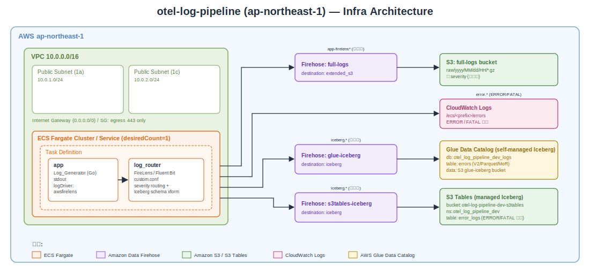

# handson-log-to-iceberg

この手順は[BigData-JAWS 勉強会 #32 Apache Icebergハンズオン会](https://jawsug-bigdata.connpass.com/event/391438/)のイベントにて利用するハンズオン資料です。

Amazon Elastic Container Service (Amazon ECS) Fargate 上で発生するLogを以下へ配信・蓄積するハンズオンです。

- Amazon Simple Storage Service (Amazon S3)
  - 全 severity のログを無加工で格納 (raw ログ)
- Amazon CloudWatch Logs
  - エラーログ (ERROR/FATAL) のみ格納
- Amazon Simple Storage Service (Amazon S3) + AWS Glue Data Catalog (セルフマネージド Apache Iceberg テーブル)
  - エラーログ (ERROR/FATAL) のみ格納
- Amazon S3 Tables (マネージド Apache Iceberg テーブル)
  - エラーログ (ERROR/FATAL) のみ格納

インフラはすべて Terraform (`infra/`) で構築します、リージョンは**ap-northeast-1 (東京)** を対象とします。

## リポジトリ構成

| パス                                 | 内容                                                                                                                                                                                                                                      |
| ------------------------------------ | ----------------------------------------------------------------------------------------------------------------------------------------------------------------------------------------------------------------------------------------- |
| `app/`                               | Go 製ダミー OTel ログジェネレーター + マルチステージ `Dockerfile`                                                                                                                                                                         |
| `fluent-bit/`                        | FireLens (Fluent Bit) 設定。`custom.conf` (severity ベースルーティング)、`parsers.conf` (アプリ JSON を `log` から展開する parser)、`iceberg_transform.lua` (Iceberg 向けスキーマ整形)、`Dockerfile` (これらをベイクするカスタムイメージ) |
| `infra/`                             | Terraform 構成一式 (Amazon VPC / Amazon ECS / Amazon Data Firehose / Amazon S3 / Amazon S3 Tables / AWS Glue / AWS IAM など)                                                                                                              |
| `infra/verify.sh`                    | Terraform 構成のスナップショット静的検証スクリプト                                                                                                                                                                                        |
| `docs/e2e-verification-checklist.md` | デプロイ後の手動 E2E 検証チェックリスト                                                                                                                                                                                                   |

## Infrastructure (Terraform)

Terraform 構成は `infra/` ディレクトリに配置されています。

> **必要バージョン**
> Terraform `>= 1.5`、AWS provider `~> 6.4` (`hashicorp/aws`)



---

# 作業用 Amazon EC2 インスタンス上でハンズオンを実行する

ローカル環境に Terraform / Go / Docker を導入せず、AWS 内に作成した 作業用 Amazon Elastic Compute Cloud (Amazon EC2) インスタンス の中でハンズオン (イメージのビルド & プッシュ、`terraform apply`、検証) を完結させる手順です。

> **なぜ Amazon EC2 を使うのか**
>
> - コンテナのビルド対象は `linux/amd64` です。**x86_64 の Amazon EC2** 上で実行すればエミュレーションなしでネイティブにビルドできます。
> - 必要なツール (Go / Docker / Terraform / AWS Command Line Interface (AWS CLI)) を 1 台に閉じ込められ、後片付けが容易です。

## 全体の流れ

1. Amazon EC2 用の AWS Identity and Access Management (IAM) ロール (インスタンスプロファイル) を作成する (マネジメントコンソール)
2. 作業用 Amazon EC2 を作成する (マネジメントコンソール)
3. SSM Session Manager で Amazon EC2 に接続する
4. Amazon EC2 内に必要ツールをインストールする
5. リポジトリを取得し、ハンズオンを実行する
6. 後片付け (Amazon EC2・IAM・AWS リソースの削除)

## 前提

- AWS アカウントを保有し、対象リージョンは ap-northeast-1。
- AWS マネジメントコンソールにログインできること。
- AdministratorAccess権限を持つこと。

## ステップ 0: Amazon EC2 用 IAM ロール (インスタンスプロファイル) の作成

作業用 Amazon EC2 はハンズオンの全 AWS リソース (Amazon VPC・Amazon ECS・Amazon Data Firehose・Amazon S3・Amazon S3 Tables・AWS Glue・IAM ロール など) を Terraform で作成します。

### IAM 準備 (マネジメントコンソール)

1. AWS マネジメントコンソールで リージョンを「アジアパシフィック (東京) ap-northeast-1」に切り替える。
2. **IAM** サービスを開き、左メニューから「ロール」を選択し、「ロールを作成」をクリック。
3. 信頼されたエンティティタイプ: 「AWS のサービス」を選択。ユースケース: 「EC2」を選択し、「次へ」をクリック。
4. 許可ポリシーの追加:
   - 検索欄で `AdministratorAccess` を検索し、チェックを入れる。
   - 続けて `AmazonSSMManagedInstanceCore` を検索し、チェックを入れる。
   - 「次へ」をクリック。
5. ロール名: `handson-iceberg-ec2-role` を入力。
6. 「ロールを作成」をクリック。

> IAM コンソールでロールを作成すると、同名のインスタンスプロファイル (`handson-iceberg-ec2-role`) が自動的に作成されます。ステップ 1 で IAM インスタンスプロファイルを選択する際にはこの名前を使用します。

## ステップ 1: 作業用 Amazon EC2 の作成

推奨スペック: **Amazon Linux 2023 / x86_64 / t3.large (2 vCPU・8 GB) / gp3 30 GB**。Docker ビルドと Terraform を快適に動かすため t3.large 程度を推奨します。

ステップ 0 でロール (インスタンスプロファイル) を作成済みであることが前提です。

### マネジメントコンソールで Amazon EC2 を起動

1. AWS マネジメントコンソールで リージョンを「アジアパシフィック (東京) ap-northeast-1」に切り替える。
2. **Amazon EC2** サービスを開き、左メニューから「インスタンス」を選択し、「インスタンスを起動」をクリック。
3. **名前とタグ**: 名前に `handson-iceberg-builder` を入力。
4. **アプリケーションおよび OS イメージ (AMI)**: Amazon Linux → **Amazon Linux 2023 (64 ビット x86)** を選択。
5. **インスタンスタイプ**: `t3.large` を選択。
6. **キーペア (ログイン)**: SSM で接続するため「**キーペアなしで続行**」を選択 (SSH は使いません)。
7. **ネットワーク設定**: 既定の Amazon VPC / サブネットでよい。「**パブリック IP の自動割り当て**」を **有効** にする。セキュリティグループは**default**を利用
8. **ストレージを設定**: ルートボリュームを **30 GiB / gp3** に変更。
9. **高度な詳細** を展開:
   - **IAM インスタンスプロファイル**: `handson-iceberg-ec2-role` を選択。
10. 右側の概要を確認し「**インスタンスを起動**」をクリック。
11. インスタンス一覧画面で、ステータスチェックが **2/2** になるまで待つ。

> SSM Session Manager で接続するには、インスタンスが SSM エンドポイント (443番) へ到達できる必要があります。上記はパブリックサブネット + パブリック IP 構成のため、デフォルトのアウトバウンド全許可で到達できます。

## ステップ 2: Amazon EC2 へ接続する (SSM Session Manager)

マネジメントコンソールから直接接続できます。

1. **Amazon EC2** サービス → 左メニュー「インスタンス」で `handson-iceberg-builder` を選択。
2. 画面上部の「接続」ボタンをクリック。
3. 「Session Manager」タブを選択し、「接続」をクリック。

ブラウザ内にターミナルが開きます。以降のコマンドは Amazon EC2 内で実行します。

> **AWS CLI から接続する場合 (任意)**
> 手元の端末に Session Manager プラグインが導入済みであれば、インスタンス一覧画面で確認できるインスタンス ID を使って以下でも接続できます。
>
> ```bash
> aws ssm start-session --region ap-northeast-1 --target <インスタンスID>
> ```

## ステップ 3: Amazon EC2 内に必要ツールをインストールする

Amazon Linux 2023 には AWS CLI v2 と SSM Agent が同梱されています。Git / Docker / Go / Terraform を導入します。

```bash
# Git と Docker、jq (Lake Formation 設定の JSON 編集に使用)
sudo dnf install -y git docker jq

# Docker を起動 (以降の docker コマンドはすべて sudo を付けて実行する)
sudo systemctl enable --now docker

# Go (公式 tarball / バージョンは go.mod の go 1.25 系に合わせる)
GO_VERSION=1.25.5
curl -fsSL "https://go.dev/dl/go${GO_VERSION}.linux-amd64.tar.gz" -o /tmp/go.tgz
sudo rm -rf /usr/local/go && sudo tar -C /usr/local -xzf /tmp/go.tgz
echo 'export PATH=$PATH:/usr/local/go/bin' | sudo tee /etc/profile.d/go.sh
export PATH=$PATH:/usr/local/go/bin

# Terraform (HashiCorp 公式 dnf リポジトリ)
sudo dnf install -y dnf-plugins-core
sudo dnf config-manager --add-repo https://rpm.releases.hashicorp.com/AmazonLinux/hashicorp.repo
sudo dnf install -y terraform

# バージョン確認
aws --version
git --version
sudo docker --version
go version
terraform version
```

> Docker はグループ設定 (`usermod` + 再接続) を省略し、**`docker` コマンドは常に `sudo` を付けて実行**します。

## ステップ 4: リポジトリを取得してハンズオンを実行する

```bash
# 作業ディレクトリへ
cd ~

# リポジトリを取得 (このリポジトリの URL を指定)
git clone https://github.com/shigeru-oda/handson-log-to-iceberg-20260620.git handson-log-to-iceberg
cd handson-log-to-iceberg

# アカウント ID / レジストリを変数化
export AWS_REGION=ap-northeast-1
export ACCOUNT_ID=$(aws sts get-caller-identity --query Account --output text)
export ECR_REGISTRY="${ACCOUNT_ID}.dkr.ecr.${AWS_REGION}.amazonaws.com"

# --- 1) Amazon Elastic Container Registry (Amazon ECR) リポジトリ作成 & ログイン ---
aws ecr describe-repositories --repository-names log-generator --region "$AWS_REGION" \
  || aws ecr create-repository --repository-name log-generator --region "$AWS_REGION"
aws ecr describe-repositories --repository-names custom-fluent-bit --region "$AWS_REGION" \
  || aws ecr create-repository --repository-name custom-fluent-bit --region "$AWS_REGION"

aws ecr get-login-password --region "$AWS_REGION" \
  | sudo docker login --username AWS --password-stdin "$ECR_REGISTRY"

# --- 2) アプリイメージのビルド & プッシュ (linux/amd64) ---
sudo docker build --platform linux/amd64 -t "${ECR_REGISTRY}/log-generator:latest" ./app
sudo docker push "${ECR_REGISTRY}/log-generator:latest"

# --- 3) カスタム Fluent Bit イメージ (custom.conf 等をベイク) のビルド & プッシュ ---
sudo docker build --platform linux/amd64 -t "${ECR_REGISTRY}/custom-fluent-bit:latest" ./fluent-bit
sudo docker push "${ECR_REGISTRY}/custom-fluent-bit:latest"

# --- 4) Terraform でインフラをデプロイ ---
cd infra
terraform init
terraform validate
terraform apply
# applyでerrorになった場合には後続へ
```

> **AWS Lake Formation が有効なアカウントでの追加手順 (重要)**
> アカウントで AWS Lake Formation が有効化され AWS Glue Data Catalog を統制している場合、上の `terraform apply` は権限エラーで失敗します。その場合は次の「Lake Formation 権限の事前付与」を実施してから再度 `terraform apply` してください。

### Lake Formation 権限の事前付与 (Lake Formation 有効アカウントのみ)

本ハンズオンの Iceberg 配信先 (Amazon S3 Tables / AWS Glue セルフマネージド) は AWS Glue Data Catalog 上のテーブルです。アカウントで **Lake Formation が Data Catalog を統制している**場合、IAM 権限だけでは Amazon Data Firehose や Terraform がテーブルへアクセスできず、`terraform apply` が以下のようなエラーで失敗します。

- `Insufficient Lake Formation permission(s): Required Describe on otel_log_pipeline_dev_logs` (AWS Glue データベース読み取り時)
- `Role ... is not authorized to perform: glue:GetTable ...` (Amazon Data Firehose ストリーム作成時)

`AdministratorAccess` ロールでも Lake Formation の権限は別管理です。以下を実施してから再度 `terraform apply` してください。

#### 0) Lake Formation が Data Catalog を統制しているか確認する (CLI)

アカウントの Data Catalog デフォルト設定 (`CreateDatabaseDefaultPermissions` / `CreateTableDefaultPermissions`) で判定できます。

```bash
export AWS_REGION=ap-northeast-1

aws lakeformation get-data-lake-settings --region "$AWS_REGION" \
  --query 'DataLakeSettings.{CreateDatabaseDefaultPermissions:CreateDatabaseDefaultPermissions,CreateTableDefaultPermissions:CreateTableDefaultPermissions}'
```

- 両方とも **空配列 `[]`** → 「Use only IAM access control」が無効。Lake Formation が新規 DB/テーブルを完全に統制しているため、本節の事前権限付与が必要です。
- **`[{"Principal":{"DataLakePrincipalIdentifier":"IAM_ALLOWED_PRINCIPALS"},"Permissions":["ALL"]}]`** が入っている → IAM 権限のみで動く後方互換モード。この場合は通常、事前権限付与なしで `terraform apply` が成功します。。

#### 共通変数

```bash
export AWS_REGION=ap-northeast-1
export ACCOUNT_ID=$(aws sts get-caller-identity --query Account --output text)

S3TABLES_BUCKET=otel-log-pipeline-dev-s3tables
NAMESPACE=otel_log_pipeline_dev
S3TABLES_TABLE=error_logs
FIREHOSE_S3TABLES_ROLE=arn:aws:iam::${ACCOUNT_ID}:role/otel-log-pipeline-dev-firehose-s3tables-iceberg
S3TABLES_CATALOG=${ACCOUNT_ID}:s3tablescatalog/${S3TABLES_BUCKET}
```

#### 1) 実行ロールを Lake Formation 管理者に追加 (既存管理者は保持)

`put-data-lake-settings` は管理者一覧を全置換するため、既存の管理者を残したまま自分を追記します。

```bash
# 現在の管理者を確認
aws lakeformation get-data-lake-settings --region "$AWS_REGION" \
  --query 'DataLakeSettings.DataLakeAdmins'

# terraform apply を実行するロールの ARN
export ACCOUNT_ID=$(aws sts get-caller-identity --query Account --output text)
MYROLE="arn:aws:iam::${ACCOUNT_ID}:role/handson-iceberg-ec2-role"
echo "$MYROLE"

# 既存設定を保持しつつ DataLakeAdmins に自分を追記して反映
aws lakeformation get-data-lake-settings --region "$AWS_REGION" \
  | jq --arg r "$MYROLE" '.DataLakeSettings | .DataLakeAdmins += [{"DataLakePrincipalIdentifier":$r}]' \
  > /tmp/lf-settings.json
aws lakeformation put-data-lake-settings --region "$AWS_REGION" \
  --data-lake-settings file:///tmp/lf-settings.json

# 反映確認 (既存 + 自分のRoleになる)
aws lakeformation get-data-lake-settings --region "$AWS_REGION" \
  --query 'DataLakeSettings.DataLakeAdmins'
```

#### 2) Amazon S3 Tables の namespace / table を先に作成

Amazon S3 Tables への grant は対象テーブルが存在している必要があるため、該当リソースだけ先に作成します。

```bash
cd infra
terraform init
terraform apply \
  -target=aws_s3tables_table_bucket.iceberg \
  -target=aws_s3tables_namespace.iceberg \
  -target=aws_s3tables_table.error_logs
```

#### 3) Amazon Data Firehose ロールへ Amazon S3 Tables (federated カタログ) の権限を付与

Amazon S3 Tables は `s3tablescatalog/<bucket>` という federated サブカタログとして AWS Glue に現れます。Terraform の `aws_lakeformation_permissions` は `catalog_id` をアカウント ID (12桁) に限定しこの形式を扱えないため、ここだけ CLI で付与します。

```bash
# database (= namespace) に DESCRIBE
aws lakeformation grant-permissions --region "$AWS_REGION" \
  --principal DataLakePrincipalIdentifier="$FIREHOSE_S3TABLES_ROLE" \
  --permissions DESCRIBE \
  --resource "{\"Database\":{\"CatalogId\":\"$S3TABLES_CATALOG\",\"Name\":\"$NAMESPACE\"}}"

# table に ALL
aws lakeformation grant-permissions --region "$AWS_REGION" \
  --principal DataLakePrincipalIdentifier="$FIREHOSE_S3TABLES_ROLE" \
  --permissions ALL \
  --resource "{\"Table\":{\"CatalogId\":\"$S3TABLES_CATALOG\",\"DatabaseName\":\"$NAMESPACE\",\"Name\":\"$S3TABLES_TABLE\"}}"
```

付与確認 (Principal 指定時は Resource も必須):

```bash
aws lakeformation list-permissions --region "$AWS_REGION" \
  --principal DataLakePrincipalIdentifier="$FIREHOSE_S3TABLES_ROLE" \
  --resource "{\"Database\":{\"CatalogId\":\"$S3TABLES_CATALOG\",\"Name\":\"$NAMESPACE\"}}" \
  --query 'PrincipalResourcePermissions[].Permissions'   # => [["DESCRIBE"]]

aws lakeformation list-permissions --region "$AWS_REGION" \
  --principal DataLakePrincipalIdentifier="$FIREHOSE_S3TABLES_ROLE" \
  --resource "{\"Table\":{\"CatalogId\":\"$S3TABLES_CATALOG\",\"DatabaseName\":\"$NAMESPACE\",\"Name\":\"$S3TABLES_TABLE\"}}" \
  --query 'PrincipalResourcePermissions[].Permissions'   # => [["ALL"]]
```

#### 4) 残りをデプロイ

```bashy
terraform apply
```

#### 5) Athena でクエリするロールへ SELECT を付与 (Lake Formation 有効アカウントのみ)

Lake Formation が完全管理モード (`CreateTableDefaultPermissions` が空) の場合、Data Lake 管理者であっても **テーブルデータへの SELECT は自動付与されません**。この状態で Amazon Athena から Iceberg テーブルを検索すると、次のエラーになります。

```
COLUMN_NOT_FOUND: line 1:8: Relation contains no accessible columns
```

これはスキーマ欠落ではなく、クエリ実行ロールがどの列にも SELECT 実効権限を持たない (SELECT が grant option にしか無い) ために全列がフィルタされる症状です。クエリを実行するロールへ SELECT / DESCRIBE を付与します。

```bash
# クエリを実行する IAM/AWS IAM Identity Center (SSO) ロールの ARN を指定する。
# 例: IAM Identity Center の AdministratorAccess ロールの実体 ARN を取得
QUERY_ROLE=$(aws iam list-roles \
  --query "Roles[?contains(RoleName,'AWSReservedSSO_AWSAdministratorAccess')].Arn" \
  --output text)
echo "$QUERY_ROLE"

# AWS Glue セルフマネージド側 (database otel_log_pipeline_dev_logs / table errors) へ付与
aws lakeformation grant-permissions --region "$AWS_REGION" \
  --principal DataLakePrincipalIdentifier="$QUERY_ROLE" \
  --permissions SELECT DESCRIBE \
  --resource '{"Table":{"DatabaseName":"otel_log_pipeline_dev_logs","Name":"errors"}}'

# 付与確認 (実効 Permissions に SELECT / DESCRIBE が入る)
aws lakeformation list-permissions --region "$AWS_REGION" \
  --principal DataLakePrincipalIdentifier="$QUERY_ROLE" \
  --resource '{"Table":{"DatabaseName":"otel_log_pipeline_dev_logs","Name":"errors"}}' \
  --query 'PrincipalResourcePermissions[].Permissions'
```

> Amazon S3 Tables 側 (namespace `otel_log_pipeline_dev` / table `error_logs`) も Amazon Athena で検索したい場合は、federated カタログ ID を指定して同様に付与します。
>
> ```bash
> aws lakeformation grant-permissions --region "$AWS_REGION" \
>   --principal DataLakePrincipalIdentifier="$QUERY_ROLE" \
>   --permissions SELECT DESCRIBE \
>   --resource "{\"Table\":{\"CatalogId\":\"$S3TABLES_CATALOG\",\"DatabaseName\":\"$NAMESPACE\",\"Name\":\"$S3TABLES_TABLE\"}}"
> ```
>
> **Amazon S3 Tables を Amazon Athena でクエリする際の SQL 記法 (重要)**
> Amazon S3 Tables の federated カタログ (`s3tablescatalog/<テーブルバケット名>`) は、Amazon Athena の
> データカタログ一覧には独立したカタログとして現れず、常に `AwsDataCatalog` 配下のサブ
> カタログとして扱われます。そのため SQL の `FROM` 句には
> **`"s3tablescatalog/<テーブルバケット名>"."<namespace>"."<table>"` の 3 階層パス**を
> 書いてください (コンソールでデータソース/データベースを選択していても、クエリ文字列側に
> カタログ名を含める必要があります)。例:
>
> ```sql
> SELECT count(*) FROM "s3tablescatalog/otel-log-pipeline-dev-s3tables"."otel_log_pipeline_dev"."error_logs";
> ```
>
> また、Amazon Athena のクエリ結果出力先がアカウントリージョナルネームスペースバケット
> (`[prefix]-[account]-[region]-an` 形式) だと、`MissingNamespaceHeader` エラーになる場合が
> あります。その場合はワークグループのクエリ結果出力先を、通常の Amazon S3 バケット (例: 本ハンズ
> オンの full-logs バケット配下 `athena-results/`) に変更してください。詳細は
> `docs/e2e-verification-checklist.md` の「4-B」を参照してください。

デプロイ後の動作確認 (Amazon S3 に全 severity が蓄積される / Amazon CloudWatch に ERROR・FATAL のみ / Iceberg テーブルにエラーログのみ) は **`docs/e2e-verification-checklist.md`** のチェックリストに沿って実施してください。

## ステップ 5: 後片付け

課金リソースを残さないよう、検証が終わったら必ず削除します。

> **AWS Lake Formation 有効アカウントでの事前権限付与 (destroy 前・重要)**
> Lake Formation が完全管理モードの場合、`AdministratorAccess` や Data Lake 管理者であっても
> テーブル/DB の `DROP` などの**実効権限**は Lake Formation 側で別管理です。これが無いと `terraform destroy`
> が次のエラーで失敗します。
>
> ```
> AccessDeniedException: Insufficient Lake Formation permission(s): Required Drop on errors
> ```
>
> （apply 時の SELECT/INSERT 不足と同じ「grant option はあるが実効権限が無い」症状です。）
>
> なお、この付与を Terraform (`aws_lakeformation_permissions`) で管理しても destroy は解決しません。
> grant リソースが対象テーブルに依存するため、`terraform destroy` ではテーブルより**先に grant が
> revoke** され、結局テーブル削除時に `DROP` を失います（鶏卵問題）。そのため destroy 直前に CLI で
> 実行ロールへ付与します。
>
> ```bash
> export AWS_REGION=ap-northeast-1
> # terraform destroy を実行するロール ARN
> # (本ハンズオンは作業用 Amazon EC2 のインスタンスプロファイル `handson-iceberg-ec2-role` から実行するため、
> #  そのロールの ARN を指定する。SSO ユーザーのローカル端末から直接 destroy する場合は、
> #  代わりに実行中の SSO ロールの実体 ARN を指定すること)
> ACCOUNT_ID=$(aws sts get-caller-identity --query Account --output text)
> EXEC_ROLE="arn:aws:iam::${ACCOUNT_ID}:role/handson-iceberg-ec2-role"
> S3TABLES_CATALOG=${ACCOUNT_ID}:s3tablescatalog/otel-log-pipeline-dev-s3tables
>
> # AWS Glue セルフマネージド側: table と database へ削除に必要な実効権限を付与
> aws lakeformation grant-permissions --region "$AWS_REGION" \
>   --principal DataLakePrincipalIdentifier="$EXEC_ROLE" \
>   --permissions DROP ALTER DELETE DESCRIBE INSERT SELECT \
>   --resource '{"Table":{"DatabaseName":"otel_log_pipeline_dev_logs","Name":"errors"}}'
> aws lakeformation grant-permissions --region "$AWS_REGION" \
>   --principal DataLakePrincipalIdentifier="$EXEC_ROLE" \
>   --permissions DROP DESCRIBE CREATE_TABLE \
>   --resource '{"Database":{"Name":"otel_log_pipeline_dev_logs"}}'
>
> # Amazon S3 Tables 側 (federated カタログ) も同様に付与
> aws lakeformation grant-permissions --region "$AWS_REGION" \
>   --principal DataLakePrincipalIdentifier="$EXEC_ROLE" \
>   --permissions DROP ALTER DELETE DESCRIBE \
>   --resource "{\"Table\":{\"CatalogId\":\"$S3TABLES_CATALOG\",\"DatabaseName\":\"otel_log_pipeline_dev\",\"Name\":\"error_logs\"}}"
> ```

```bash
# 1) Terraform で作成した AWS リソースを削除 (Amazon EC2 内 infra/ ディレクトリで)
cd ~/handson-log-to-iceberg/infra
terraform destroy
# Amazon S3 バケットにオブジェクトが残っていると destroy が失敗するため、必要なら中身を空にしてから再実行

# 2) Amazon ECR リポジトリの削除 (任意)
aws ecr delete-repository --repository-name log-generator --force --region ap-northeast-1
aws ecr delete-repository --repository-name custom-fluent-bit --force --region ap-northeast-1
```

作業用 Amazon EC2 と IAM の削除 (マネジメントコンソール):

1. **Amazon EC2 の終了**:
   - Amazon EC2 コンソール → 左メニュー「インスタンス」で `handson-iceberg-builder` を選択。
   - 「インスタンスの状態」メニュー → 「インスタンスを終了 (削除)」をクリック。
   - 確認ダイアログで「終了」を実行。ステータスが「terminated」になるまで待つ。

2. **IAM ロール / インスタンスプロファイルの削除**:
   - IAM コンソール → 左メニュー「ロール」で `handson-iceberg-ec2-role` を検索し選択。
   - 「削除」をクリックし、確認ダイアログでロール名を入力して削除を実行。
   - (IAM コンソールでロールを作成した場合、ロール削除時にインスタンスプロファイルも自動削除されます。)

## 補足

- **AdministratorAccess は広範な権限** です。ハンズオン専用とし、完了後は必ず削除してください。
- ローカルバックエンドのステートはこの Amazon EC2 上 (`infra/` 配下) に保存されます。Amazon EC2 を終了するとステートも失われるため、**先に `terraform destroy` を実行** してから Amazon EC2 を終了してください。
- AWS Graviton (arm64) の Amazon EC2 を使う場合は、`docker build --platform linux/amd64` がエミュレーションとなりビルドが遅くなります。本ハンズオンでは **x86_64 インスタンス** を推奨します。
